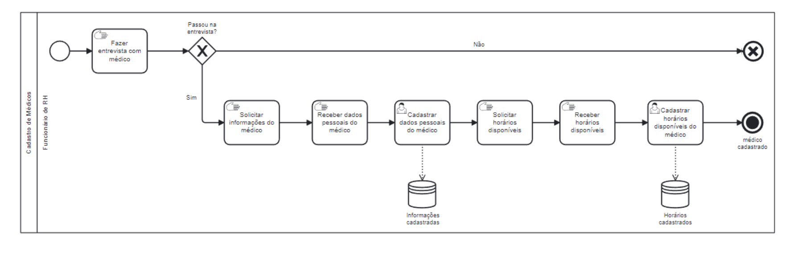
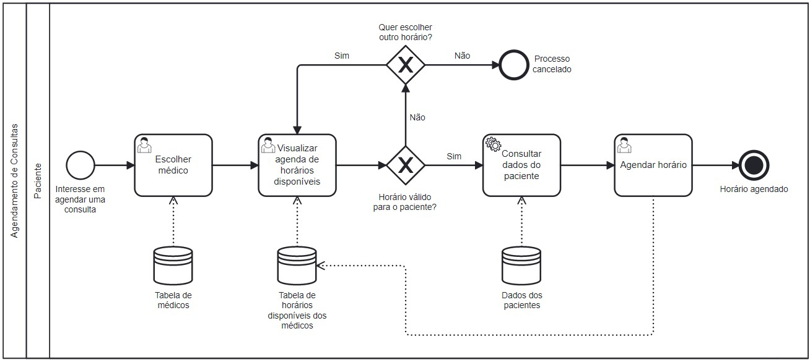
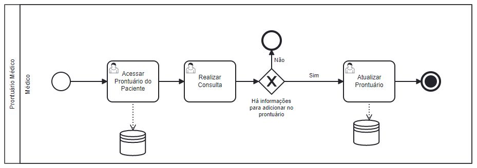
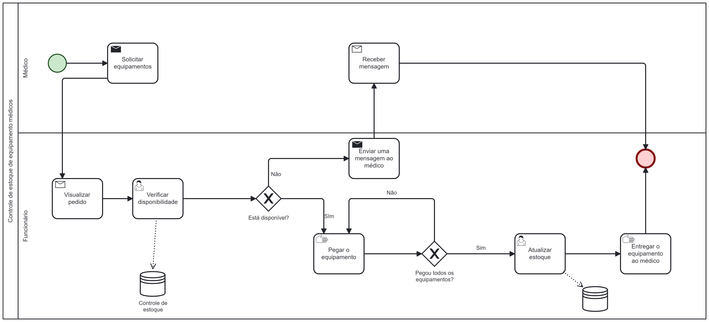
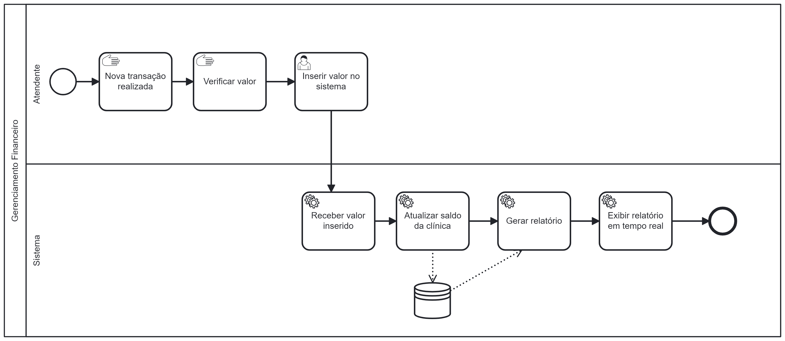

# MedHelp

**Letícia Rodrigues Blom de Paula, leticiarblom@gmail.com**

**Arthur Capanema Bretas, arthurcbretas@gmail.com**

**Igor Miranda Santos, igormsprofissional@gmail.com**

**Júlia Borges Araújo Silva, juliaborgesfacul@gmail.com**

**Gabriel Vitor de Oliveira Morais, gabrielvitor0309@gmail.com**

---

Professores:

**Hugo Bastos de Paula**

**Eveline Alonso Veloso**

---

_Curso de Engenharia de Software, Unidade Praça da Liberdade_

_Instituto de Informática e Ciências Exatas – Pontifícia Universidade de Minas Gerais (PUC MINAS), Belo Horizonte – MG – Brasil_

---

_**Resumo**. Escrever aqui o resumo. O resumo deve contextualizar rapidamente o trabalho, descrever seu objetivo e, ao final, 
mostrar algum resultado relevante do trabalho (até 10 linhas)._

---

## 1. Introdução

    1.1 Contextualização

Entendendo a saúde como um direito humano básico, que deve ser assegurado da melhor maneira estratégica possível, (JÚNIOR; PENHA; SILVA, 2013), e, juntamente, considerando o uso da tecnologia no campo da saúde um acontecimento relativamente recente, iniciado a pouco mais de 25 anos, (WECHSLER et al., 2003), pode-se deduzir que há oportunidades para aprimoramento na integração das duas áreas, aproveitando o potencial da tecnologia como meio para impulsionar importantes progressos na área da medicina. 

Também, sendo a existência de um software adequado ao sistema, um componente fundamental para qualquer iniciativa relacionada à gestão de saúde, é crucial a utilização de softwares de qualidade para um bom funcionamento da gestão e atendimento de um ambiente médico. (COSTA; ORLOVKI, 2014).

Assim, o trabalho se desenvolve em função de ser um sistema de software feito como um facilitador tanto para a empresa como para o usuário, respectivamente, profissionais da saúde e pacientes, procurando sempre atender as necessidades dos clientes e prezando pela facilidade de acesso dos prestadores de serviço.

    1.2 Problema
Uma clínica médica enfrenta vários problemas de organização, que inclui, agendamento de pacientes, manter um registro preciso de suas consultas, sincronização de dados e falta de organização no armazenamento desses dados. Que são causados por seu sistema de gerenciamento pouco integrado e que faz uso de tecnologias ultrapassadas.

Esses diversos problemas tornam essencial a criação de um sistema de software mais preparado para gerir e organizar a rotina dessas unidades de saúde. 

    1.3 Objetivo geral
Com base nas informações e dados apresentados, torna-se evidente a grande necessidade de desenvolver um sistema de software que possa melhorar significativamente a qualidade das clínicas e a experiência dos usuários.

        1.3.1 Objetivos específicos
Para amenizar a maioria dos problemas relacionados ao agendamento de consultas, é fundamental desenvolver um software com o objetivo de oferecer:
- Comodidade aos pacientes em qualquer localidade e a qualquer momento, por meio do agendamento online. 
- O software deve visar a melhoria substancial da experiência do paciente, reduzindo filas e esperas para o agendamento de consultas. 
-  Proporcionar um atendimento mais eficiente e ágil. 
Com essa solução tecnológica, é possível simplificar o processo de agendamento, com:
- Aumento da precisão das informações registradas
- Diminuição das chances de erros 
- Garantia de um fluxo mais rápido e organizado de pacientes no hospital ou clínica. 
Dessa forma, o software de agendamento contribui para a otimização dos recursos de saúde e para o aumento da satisfação e fidelização dos pacientes.

    1.4 Justificativas

Com a crescente demanda por atendimento médico, a implementação de um software de clínica médica pode ser uma solução efetiva para melhorar a qualidade do atendimento aos pacientes. Além disso, essa tecnologia pode aumentar a eficiência operacional, facilitar o gerenciamento de informações, otimizar a tomada de decisão e, principalmente, garantir a segurança dos pacientes. Com todas essas vantagens, investir em um software de clínica médica é uma escolha inteligente para quem deseja melhorar o desempenho da clínica ou consultório médico.
Um software de clínica médica é uma ferramenta essencial para garantir a eficiência e qualidade no atendimento médico. Com ele, é possível o agendamento consultas de forma fácil e rápida, facilitando o acesso dos pacientes aos profissionais da saúde. Além disso, o software permite o registro completo do histórico médico do paciente, incluindo diagnósticos, tratamentos anteriores e prescrição de medicamentos. Isso torna o acompanhamento da saúde do paciente mais preciso e seguro.

## 2. Participantes do processo

Pacientes: São usuários com idade entre 18 e 65+, que têm o papel de acessar o sistema para se cadastar ou, se já cadastrados, marcar consultas para si mesmos ou para menores de idade, como filhos, sobrinhos ou netos.

Médicos: São usuários com formação acadêmica na área da saúde, seu papel é acessar o sistema para visualizar consultas já marcadas pelos pacientes da clínica.

Atendentes: São usuários que já foram contratados para fazer a gestão da clínica dentro do software como: gestão financeira, cadastro de médicos e atendimento ao cliente.

## 3. Modelagem do processo de negócio

## 3.1. Análise da situação atual

Quando o assunto é gestão de clínicas médicas, a maioria delas ainda realiza as atividades manualmente. Entre essas atividades, destacam-se a agenda eletrônica, o prontuário eletrônico, o cadastro de médicos, o gerenciamento financeiro e os relatórios gerenciais. Nosso objetivo é automatizar todos os processos para agilizar e proporcionar mais segurança, evitando a perda de dados da clínica.

Com relação à agenda eletrônica, é possível implementar melhorias, como personalização de lembretes para reduzir faltas às consultas, visualização do histórico de consultas dos pacientes para planejamento das próximas consultas e integração com sistemas de telemedicina.

Já o prontuário eletrônico pode ser aprimorado com a integração com a agenda eletrônica, permitindo o agendamento de consultas e exames diretamente no sistema, compartilhamento de informações entre profissionais autorizados e acesso aos prontuários dos pacientes em tempo real.

O cadastro de médicos pode ser aprimorado com a inclusão de informações adicionais sobre a formação e experiência dos profissionais, a implementação de um sistema de avaliação pelos pacientes e a integração com a agenda eletrônica e prontuário eletrônico para maior integração dos sistemas.

No que diz respeito ao gerenciamento financeiro, a geração de relatórios financeiros em tempo real e a integração com sistemas de gestão de estoque podem ajudar a clínica a ter uma visão geral mais precisa de seu desempenho financeiro e gerenciar melhor seus recursos.

Por fim, quanto aos relatórios gerenciais, pode-se incluir informações sobre a disponibilidade dos médicos e relatórios de fluxo de pacientes.

Em suma, a análise da situação atual das clínicas médicas mostra que a implementação dessas melhorias nos sistemas e ferramentas pode otimizar o atendimento aos pacientes, melhorar o desempenho financeiro, aprimorar a gestão dos recursos e profissionais da saúde.

## 3.2. Descrição Geral da proposta

O primeiro passo para iniciar os processos de uma clínica médica gerenciada pela MedHelp é cadastrar médicos que farão parte da equipe. Para isso, um funcionário da clínica realizará uma entrevista com o médico interessado e, ao ser aceito, suas informações serão coletadas e agregadas ao sistema, tais como nome completo, especialidade, formação, endereço, telefone(s) e e-mail.

Com os médicos contratados, a clínica estará preparada para receber pacientes, e o papel do software é facilitar o agendamento. Por meio do sistema, o cliente que já fez login no sistema poderá visualizar uma lista de médicos disponíveis e seus horários, com um indicador de ocupação para facilitar a escolha do profissional.

No momento do atendimento, o médico estará logado em sua conta e, caso o paciente possua uma ficha cadastrada na clínica, ele terá acesso ao prontuário do paciente que contém informações importantes para a consulta, como, por exemplo, condições crônicas e histórico de consultas. Caso o paciente não possua uma ficha, o médico responsável deverá criá-la durante o atendimento.

Outra funcionalidade do sistema é a gestão financeira da clínica. Com os funcionários registrando os gastos realizados pela clínica, é feito um gráfico indicando para onde o dinheiro está sendo destinado, facilitando a visualização e gestão desses gastos.

Para complementar a gestão financeira, a MedHelp possui um controle de estoque que será um processo feito pelos atendentes da clínica, pelos médicos e pelo sistema. Os médicos registrarão os equipamentos e medicamentos usados nos atendimentos, o sistema descontará do estoque, e quando algum produto estiver acabando, o software notificará os funcionários da clínica para que seja feito o reabastecimento.

Enfim, é importante ressaltar que a plataforma MedHelp visa facilitar, agilizar e organizar os processos de uma clínica médica. No entanto, é importante ter em mente que há limitações do sistema, já que processos manuais, como entrevistas de contratação e consultas, necessitam da intervenção humana para funcionarem adequadamente.

## 3.3. Modelagem dos Processos

### 3.3.1 Processo 1 – CADASTRO DE MÉDICOS

O primeiro processo se inicia com a etapa de admissão de novos médicos na MedHelp, sendo feita por meio de uma entrevista conduzida por um funcionário da clínica. Após a entrevista, caso o médico seja aprovado, serão solicitadas informações adicionais, como nome completo, especialidade, formação, endereço, telefone(s) e e-mail, que serão fornecidas pelo médico e agregadas ao sistema pela equipe da clínica, mantendo um cadastro completo de todos os médicos da equipe.

### 3.3.2 Processo 2 – AGENDAMENTO DE CONSULTAS

Após a contratação dos médicos, a clínica já está pronta para receber seus pacientes e, para isso, eles precisam marcar um horário de atendimento com o profissional desejado. O sistema mostra para o paciente os horários disponíveis e ao agendar em um desses horários o software atualizar os dados automaticamente. 

### 3.3.3 Processo 3 -PRONTUÁRIO MÉDICO
Com as informações disponíveis no banco de dados, o médico poderá acessá-las durante a consulta para verificar o histórico médico do paciente, identificar possíveis alergias a medicamentos, verificar os medicamentos que o paciente está tomando atualmente, entre outras informações importantes que podem ajudar no diagnóstico e tratamento do paciente.

Ao final da consulta, o médico poderá acrescentar novas informações relevantes no prontuário médico do paciente, como a prescrição de medicamentos, exames solicitados, recomendações de cuidados em casa, entre outras informações importantes. Isso garante que todas as informações relevantes para o tratamento do paciente fiquem armazenadas em um só lugar e possam ser acessadas facilmente em consultas futuras.

### 3.3.4 Processo 4 – CONTROLE DE ESTOQUE
Após o agendamento da consulta, o médico irá solicitar os equipamentos necessários para realizar o atendimento do cliente. Para isso, ele enviará uma mensagem ao funcionário responsável, informando quais ferramentas serão necessárias. O funcionário, por sua vez, irá anotar os equipamentos solicitados e verificar a disponibilidade dos mesmos no estoque. Caso algum equipamento esteja indisponível, ele enviará uma mensagem ao médico informando a situação e encerrando o processo.
Porém, caso todos os equipamentos estejam disponíveis, o funcionário irá retirá-los do estoque, dar baixa no sistema e entregá-los ao médico. Dessa forma, garantimos que todos os equipamentos necessários para a consulta estejam disponíveis e que o processo ocorra de forma eficiente e organizada

### 3.3.5 Processo 5 – GESTÃO FINANCEIRA

Após a conclusão da consulta, o paciente se dirige à recepção para efetuar o pagamento à clínica. Um funcionário da clínica, então, confirma se o paciente possui plano de saúde e se o plano tem cobertura para a clínica em questão. Caso ele possua um plano de saúde com cobertura para a clínica, o atendente verifica o pagamento pelo plano de saúde, registra no sistema e emite o recibo para o cliente. Se o cliente não tiver plano de saúde ou se o plano de saúde não oferecer cobertura para a clínica, o atendente informa o valor da consulta ao paciente, que escolhe o método de pagamento e realiza o pagamento. Em seguida, o atendente registra o pagamento no sistema e emite o recibo ao cliente.

## 4. Projeto da Solução

### 4.1. Detalhamento das atividades

Descrever aqui cada uma das propriedades das atividades de cada um dos processos. Devem estar relacionadas com o modelo de processo apresentado anteriormente.

#### Processo 1 – NOME DO PROCESSO

**Nome da atividade 1**

| **Campo** | **Tipo** | **Restrições** | **Valor default** |
| --- | --- | --- | --- |
| [Nome do campo] | [Área de texto, Caixa de texto, Número, Data, Imagem, Seleção única, Múltipla escolha, Arquivo, Link, Tabela] |  |  |
| ***Exemplo:***  |    |     |
| login | Caixa de Texto | formato de e-mail |  |
| senha | Caixa de Texto | mínimo de 8 caracteres |   |

**Nome da atividade 2**

| **Campo** | **Tipo** | **Restrições** | **Valor default** |
| --- | --- | --- | --- |
| [Nome do campo] | [Área de texto, Caixa de texto, Número, Data, Imagem, Seleção única, Múltipla escolha, Arquivo, Link, Tabela] |  |  |
|    |    |     |

#### Processo 2 – AGENDAMENTO DE CONSULTAS

**Escolher médico**

| **Campo** | **Tipo** | **Restrições** | **Valor default** |
| --- | --- | --- | --- |
| [Escolher médico] | [Tabela] | - | - |
|    |    |     |

**Visualizar agenda de horários disponíveis**

| **Campo** | **Tipo** | **Restrições** | **Valor default** |
| --- | --- | --- | --- |
| [Visualizar agenda de horários disponíveis] | [Tabela] | - | - |
|    |    |     |

**Agendar horário**

| **Campo** | **Tipo** | **Restrições** | **Valor default** |
| --- | --- | --- | --- |
| [Agendar horário] | [Seleção única] | Necessário selecionar o horário | Nada selecionado |
|    |    |     |

### 4.2. Tecnologias

Descreva qual(is) tecnologias você vai usar para resolver o seu problema, ou seja implementar a sua solução. Liste todas as tecnologias envolvidas, linguagens a serem utilizadas, serviços web, frameworks, bibliotecas, IDEs de desenvolvimento, e ferramentas. Apresente também uma figura explicando como as tecnologias estão relacionadas ou como uma interação do usuário com o sistema vai ser conduzida, por onde ela passa até retornar uma resposta ao usuário.

## 5. Modelo de dados

Apresente o modelo de dados por meio de um modelo relacional ou Diagrama de Entidade-Relacionamento (DER) que contemple todos conceitos e atributos apresentados item anterior. 

## 6. Indicadores de desempenho

Apresente aqui os principais indicadores de desempenho e algumas metas para o processo. Atenção: as informações necessárias para gerar os indicadores devem estar contempladas no diagrama de classe. Colocar no mínimo 5 indicadores.

Usar o seguinte modelo:

| **Indicador** | **Objetivos** | **Descrição** | **Cálculo** | **Fonte dados** | **Perspectiva** |
| --- | --- | --- | --- | --- | --- |
| Percentual reclamações | Avaliar quantitativamente as reclamações | Percentual de reclamações em relação ao total atendimento |   | Tabela reclamações | Aprendizado e Crescimento |
| Taxa de Requisições abertas | Melhorar a prestação de serviços medindo a porcentagem de requisições | Mede % de requisições atendidas na semana |  | Tabela solicitações | Processos internos |
| Taxa de entrega de material | Manter controle sobre os materiais que estão sendo entregues | Mede % de material entregue dentro do mês |   | Tabela Pedidos | Clientes |

Obs.: todas as informações para gerar os indicadores devem estar no diagrama de classe **a ser proposto**

## 7.Sistema desenvolvido

Faça aqui uma breve descrição do software e coloque as principais telas com uma explicação de como usar cada uma.

## 8. Conclusão

Apresente aqui a conclusão do seu trabalho. Discussão dos resultados obtidos no trabalho, onde se verifica as observações pessoais de cada aluno. Poderá também apresentar sugestões de novas linhas de estudo.

# REFERÊNCIAS

*[1.1]* - _JUNIOR, Ivo PG; PENHA, L. M.; SILVA, C. M.. *A importância da tecnologia da informação como ferramenta para o processo da gestão hospitalar no setor privado: um estudo de caso em uma organização hospitalar em Feira de Santana (BA)*. Revista de Gestão em Sistemas de Saúde - RGSS, São Paulo, v. 2, n. 1, p. 91-115, jan./jun. 2013.

*[1.2]* - _WECHSLER, R. et al. *A informática no consultório médico*. Jornal de Pediatria, [S. l.], ano 2003, v. 79, n. 1, p. 3-12, 3 mar. 2003. Disponível em: https://core.ac.uk/reader/193076380. Acesso em: 27 fev. 2023.

*[1.3]* - _Costa, Karine. Orlovski, Regiane *A Importânicia da Utilização do Software na Área da Saúde*. Revista Científica Semana Acadêmica. Fortaleza, ano MMXIV, Nº. 000050, 06/03/2014. Disponível em: https://semanaacademica.org.br/artigo/importancia-da-utilizacao-do-software-na-area-da-saude. Acesso em: 28 fev. 2023.

# APÊNDICES

**Colocar link:**

Do código (armazenado no repositório);

Dos artefatos (armazenado do repositório);

Da apresentação final (armazenado no repositório);

Do vídeo de apresentação (armazenado no repositório).

